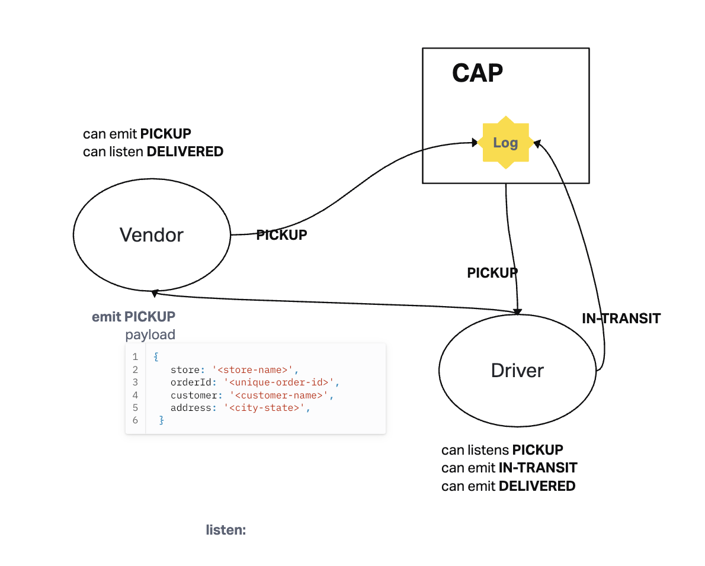

# Emit Emitter

## Project: Bearer Authentication

### Author: Francisco

### Problem Domain

CAPS Phase 1: Begin the build of an application for a product called CAPS - The Code Academy Parcel Service. In this sprint, we’ll build out a system that emulates a real world supply chain. CAPS will simulate a delivery service where vendors (such a flower shops) will ship products using our delivery service and when our drivers deliver them, each vendor will be notified that their customers received what they purchased.

### Links and Resources

- [GitHub Actions ci/cd](https://github.com/c0d3cisco/Event-Driven-App/actions)

## Collaborators

Code while following lesson from Ryan Gallaway.

### Setup

#### How to initialize/run your application (where applicable)

1. Clone this repository to a location of your choosing. In the terminal, navigate to the directory and run the following commands:
2. `npm i` to install dependencies
3. `npm start` to start the application

#### Tests

run the command `npm test`

#### UML

